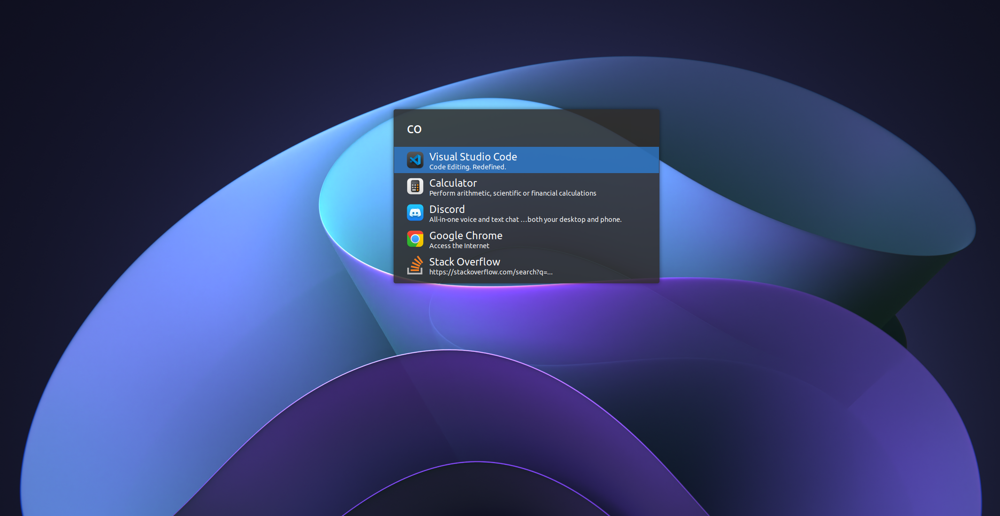

# Clean Dark

Clean Dark theme for uLauncher.

## Installation

 - `mkdir -p ~/.config/ulauncher/user-themes`
 - `cd ~/.config/ulauncher/user-themes`
 - `git clone git@github.com:kalenpw/transparent-adwaita.git`
 - Open ulauncher settings and select Clean Dark

## Screenshot

